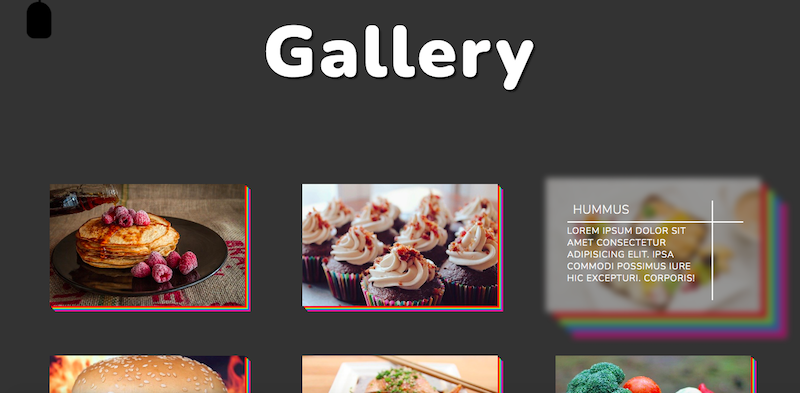

# Foods

## About

A tutorial that is part of Udemy's [10 Mega Responsive Websites with HTML, CSS, and JavaScript](https://www.udemy.com/course/10-mega-responsive-websites-with-html-css-and-javascript/) course.

## Installation Instructions

In your terminal, run `git clone https://github.com/HannaEb/foods.git`. The application can then be viewed by opening the index.html file in the browser.

## Author

HannaEb
